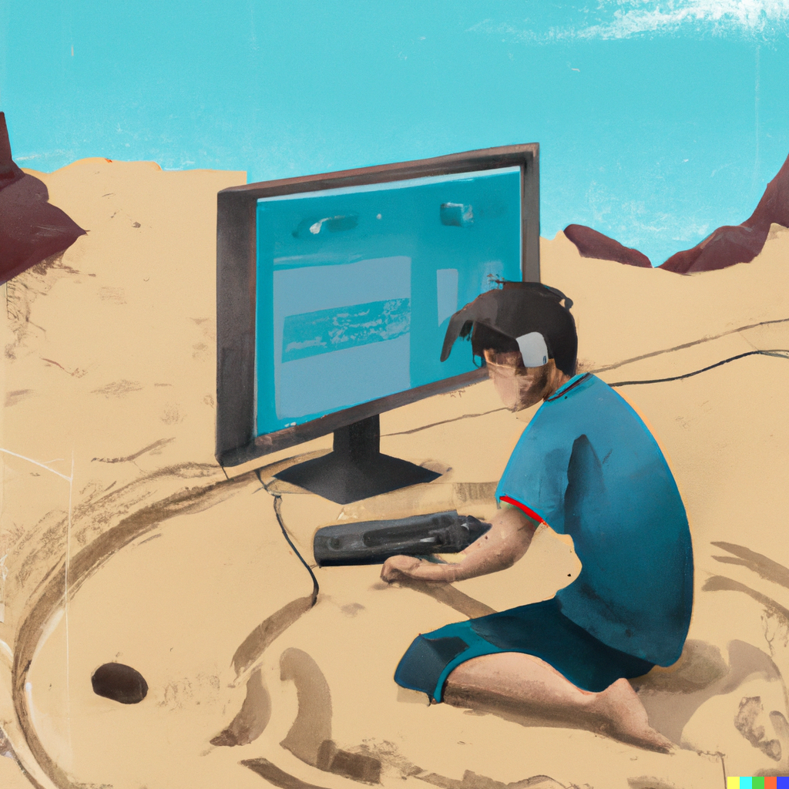

# nanotaboada/sandbox

## Manifesto

> "Nobody should start to undertake a large project. You start with a small _trivial_ project, and you should never expect it to get large. If you do, you'll just overdesign and generally think it is more important than it likely is at that stage. Or worse, you might be scared away by the sheer size of the work you envision. So start small, and think about the details. Don't think about some big picture and fancy design. If it doesn't solve some fairly immediate need, it's almost certainly over-designed. And don't expect people to jump in and help you. That's not how these things work. You need to get something half-way _useful_ first, and then others will say "hey, that _almost_ works for me", and they'll get involved in the project." — Linus Torvalds

## About

### sandbox (/ˈsan(d)bɒks/)

#### _noun_

##### 2. COMPUTING
_a testing environment in a computer system in which new or untested software or coding can be run securely._

## Credits

The image has been created by [DALL·E 2](https://openai.com/dall-e-2) with the following prompt:

> Digital illustration of a character who is coding in a sandbox located in a remote location.

## Terms

All trademarks, registered trademarks, service marks, product names, company names or logos are property of their respective owners and are used for educational purposes only.